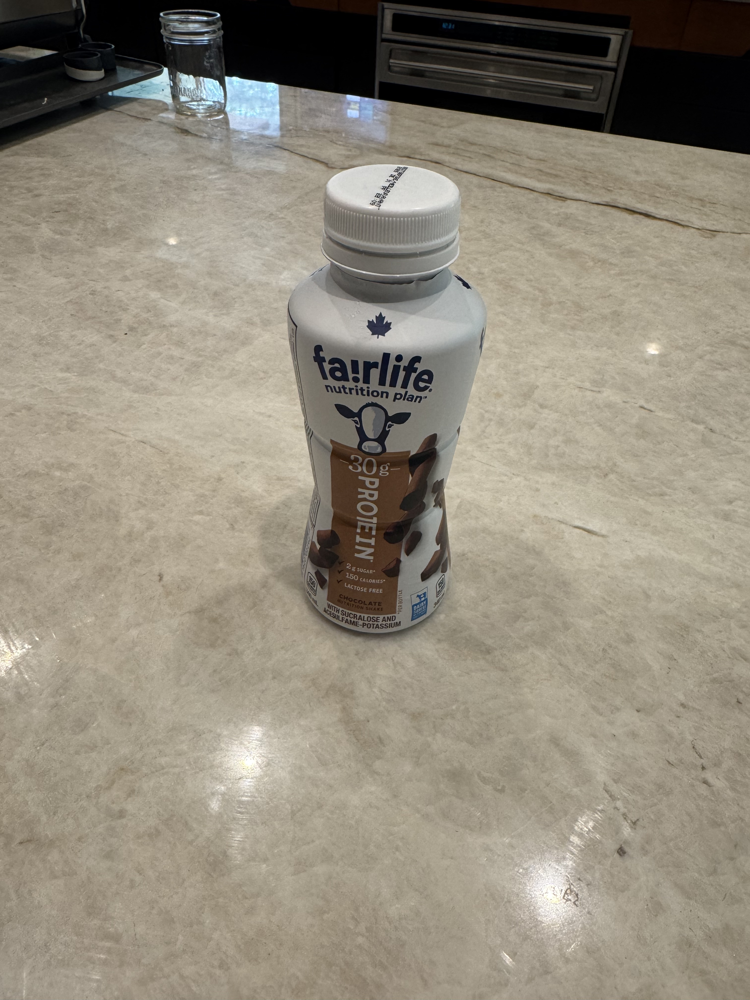
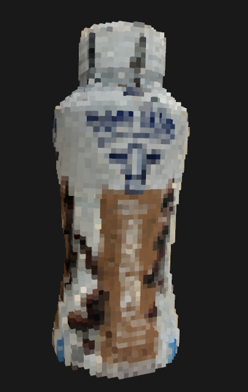
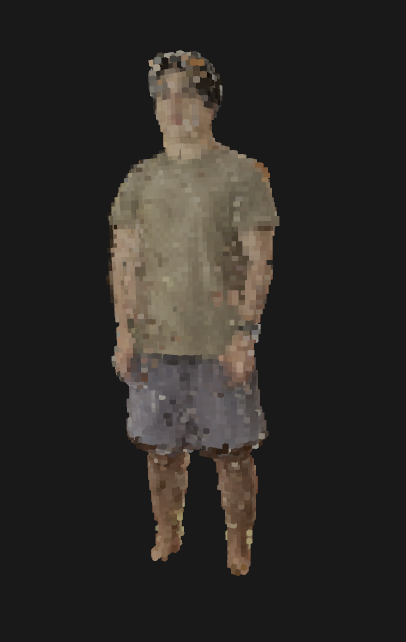

# SFMCraft: Real World to Minecraft Pipeline

Transform real-world photos and videos into stunning Minecraft builds using advanced 3D reconstruction techniques.

## Pipeline Demonstration

### Input → Structure from Motion → Voxel Grid → Minecraft Build

<table>
<tr>
<td align="center"><strong>Input</strong></td>
<td align="center"><strong>Voxel Representation</strong></td>
<td align="center"><strong>Minecraft Result</strong></td>
</tr>
<tr>
<td></td>
<td></td>
<td></td>
</tr>
<tr>
<td></td>
<td></td>
<td></td>
</tr>
</table>

## How It Works

SFMCraft converts real-world photos or video into Minecraft builds using a multi-stage 3D vision pipeline:

1. **Input Processing:** Accepts multiple photos or a video walkthrough; samples key frames for coverage.
2. **Structure from Motion:** Detects features, estimates camera poses, and reconstructs a sparse 3D point cloud.
3. **Dense Point Cloud:** Fills in geometry with multi-view stereo, computes colors, and filters noise.
4. **Voxelization:** Converts the point cloud into a colored voxel grid for Minecraft compatibility.
5. **Block Mapping:** Matches voxel colors to Minecraft blocks and optimizes placement.
6. **Minecraft Integration:** Outputs schematic files or direct world builds for easy import.

## Technical Architecture

### Python Pipeline (`src/`)
- **`pipeline.py`**: Main orchestration and workflow management
- **`sfm.py`**: Structure from Motion implementation using COLMAP
- **`multi_scan_sfm.py`**: Multi-scan SfM for large scenes
- **`postprocess_pointcloud.py`**: Point cloud filtering and enhancement
- **`voxelize.py`**: Voxel grid generation from point clouds
- **`sample_video_frames.py`**: Intelligent frame extraction from videos
- **`view_model.py`**: 3D visualization and inspection tools

### Minecraft Plugin (`Image2MC/`)
- **Java-based Minecraft plugin** for Bukkit/Spigot servers
- **Block placement optimization** for large-scale builds
- **Real-time building** with progress tracking
- **Material palette management** for accurate color representation

## Key Features

- **High-Quality Reconstruction**: Advanced SfM algorithms ensure accurate 3D geometry
- **Intelligent Block Selection**: Sophisticated color matching for realistic material representation
- **Scalable Processing**: Handles everything from small objects to large architectural scenes
- **Multiple Input Formats**: Works with photos, videos, and existing point clouds
- **Minecraft Integration**: Seamless import into Minecraft worlds via plugin or schematics

---

*Transform your world, one block at a time.*

## Setup

1. Install COLMAP:
```bash
# For Ubuntu/Debian
sudo apt-get install colmap

# For other systems, see: https://colmap.github.io/install.html
```

2. Install Python dependencies:
```bash
pip install -r requirements.txt
```

## Project Structure
- `src/`: Source code
  - `sfm.py`: Structure from Motion processing
  - `voxelize.py`: Point cloud to voxel conversion
  - `minecraft.py`: Voxel to Minecraft block conversion
- `data/`: Directory for input images and intermediate results
- `output/`: Final Minecraft build output

## Usage
1. Place your input images in `data/images/`
2. Run the SfM pipeline:
```bash
python src/sfm.py --input data/images --output data/sfm_output
```
